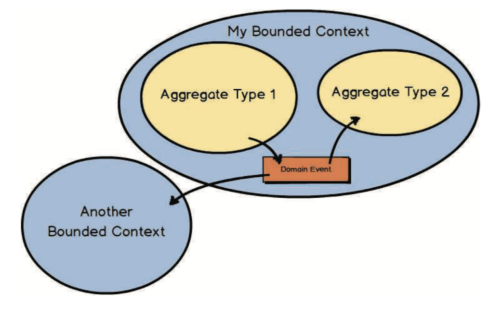

Strategic Design in DDD focuses on three interconnected pillars: **Bounded Contexts** define where a domain model is valid, **Aggregates** enforce consistency within those boundaries, and **Domain Events** enable loose communication between aggregates and across contexts. Together, they form the backbone of a well-structured domain-driven system.

::: {.callout-note appearance="simple"}
Inspired by *"Domain-Driven Design Distilled"* by Vaughn Vernon.
:::

{width=70%}

In this chapter, we use a **Radiology AI Workflow** as our running example. Here is how the three concepts map to our domain:

```{mermaid}
flowchart TB
    subgraph IC["Imaging Context"]
        A1["RadiologyStudy\n(Aggregate 1)"]
        DE[/"StudyCompletedEvent\n(Domain Event)"/]
        A2["AIAnalysisRequest\n(Aggregate 2)"]
        A1 -->|"publishes"| DE
        DE -->|"handler creates"| A2
    end

    DE -->|"also consumed by"| NC

    subgraph NC["Notification Context"]
        NH["Notify Radiologist"]
    end

    style DE fill:#f9c74f,stroke:#f48c06,color:#000
```

---

## Bounded Context

A **Bounded Context** is a boundary within which a particular domain model is defined and consistent. The same word can mean different things in different contexts — and that is perfectly fine.

For example, in a **Radiology System**:

```{mermaid}
flowchart LR
    subgraph Imaging["Imaging Context"]
        S1["<b>Study</b>\nA set of DICOM images\nfrom a modality"]
    end
    subgraph Billing["Billing Context"]
        S2["<b>Study</b>\nA billable line item\nwith CPT codes & charges"]
    end

    S1 ~~~ S2

    style S1 fill:#a8dadc,stroke:#457b9d,color:#000
    style S2 fill:#fcd5ce,stroke:#e76f51,color:#000
```

The word "Study" appears in both contexts, but each context has its own model with different attributes and behaviors. The Imaging Context cares about DICOM series and modality, while the Billing Context cares about CPT codes and charges.

::: {.callout-tip}
**Each Bounded Context owns its own model.** Do not try to create one unified "Study" model that serves both contexts — that leads to a tangled, compromised design.
:::

---

## Aggregate

An **Aggregate** is a cluster of domain objects treated as a single unit for data changes. It has one **Aggregate Root** — the only entry point for external access.

Key rules:

- Outside code can **only** hold a reference to the Aggregate Root, never to inner objects directly.
- All modifications go **through** the Aggregate Root, which enforces business invariants.

```{mermaid}
classDiagram
    class RadiologyStudy {
        &lt;&lt;Aggregate Root&gt;&gt;
        +StudyId id
        +string patient_id
        +Modality modality
        +bool is_completed
        +series : IReadOnlyList~Series~
        +add_series(description, image_count)
        +mark_as_completed()
    }

    class Series {
        &lt;&lt;Entity&gt;&gt;
        +Guid id
        +string description
        +int image_count
    }

    class Modality {
        &lt;&lt;Enum&gt;&gt;
        CT
        MR
        XR
        US
    }

    RadiologyStudy *-- "1..*" Series : owns
    RadiologyStudy --> Modality
```

::: {.callout-note}
You **never** modify a `Series` directly. You always go through `RadiologyStudy`. This is how the Aggregate Root protects data consistency.
:::


### Base Classes

Before building the aggregate, we need a few base classes that all aggregates share: a marker for domain events, a base entity, and an aggregate root that collects events for later dispatch.

::: {.panel-tabset}
#### `C#`

```csharp
// Marker interface for all domain events
public interface IDomainEvent
{
    DateTime OccurredOn { get; }
}

// Base entity identified by a typed ID
public abstract class Entity<TId> where TId : notnull
{
    public TId Id { get; protected init; } = default!;
}

// Aggregate Root — collects domain events for dispatch after persistence
public abstract class AggregateRoot<TId> : Entity<TId> where TId : notnull
{
    private readonly List<IDomainEvent> _domainEvents = [];

    public IReadOnlyList<IDomainEvent> DomainEvents => _domainEvents.AsReadOnly();

    protected void RaiseDomainEvent(IDomainEvent domainEvent)
        => _domainEvents.Add(domainEvent);

    public void ClearDomainEvents() => _domainEvents.Clear();
}
```

#### `Python`

```python
from abc import ABC, abstractmethod
from dataclasses import dataclass, field
from datetime import datetime
from uuid import UUID, uuid4


class DomainEvent(ABC):
    """Marker base class for all domain events."""

    @property
    @abstractmethod
    def occurred_on(self) -> datetime: ...


class Entity(ABC):
    """Base entity identified by a UUID."""

    def __init__(self, id: UUID) -> None:
        self._id = id

    @property
    def id(self) -> UUID:
        return self._id


class AggregateRoot(Entity, ABC):
    """Aggregate Root — collects domain events for dispatch after persistence."""

    def __init__(self, id: UUID) -> None:
        super().__init__(id)
        self._domain_events: list[DomainEvent] = []

    @property
    def domain_events(self) -> tuple[DomainEvent, ...]:
        return tuple(self._domain_events)

    def _raise_domain_event(self, event: DomainEvent) -> None:
        self._domain_events.append(event)

    def clear_domain_events(self) -> None:
        self._domain_events.clear()
```

:::


### RadiologyStudy Aggregate

The `RadiologyStudy` is our Aggregate Root. It owns `Series` (inner entities) and enforces invariants — for example, a study cannot be completed without at least one series. When marked as completed, it **raises a Domain Event**.

::: {.panel-tabset}
#### `C#`

```csharp
// ── Value Objects ──

public readonly record struct StudyId(Guid Value)
{
    public static StudyId New() => new(Guid.NewGuid());
    public override string ToString() => Value.ToString();
}

public enum Modality { CT, MR, XR, US }

// ── Inner Entity: Series (only accessible through the Aggregate Root) ──

public class Series : Entity<Guid>
{
    public string Description { get; private set; } = string.Empty;
    public int ImageCount { get; private set; }

    private Series() { }

    internal static Series Create(string description, int imageCount)
        => new()
        {
            Id = Guid.NewGuid(),
            Description = description,
            ImageCount = imageCount
        };
}

// ── Aggregate Root: RadiologyStudy ──

public class RadiologyStudy : AggregateRoot<StudyId>
{
    private readonly List<Series> _series = [];
    public IReadOnlyList<Series> Series => _series.AsReadOnly();

    public string PatientId { get; private set; } = string.Empty;
    public Modality Modality { get; private set; }
    public bool IsCompleted { get; private set; }

    private RadiologyStudy() { }

    // Factory method — only way to create
    public static RadiologyStudy Create(string patientId, Modality modality)
    {
        if (string.IsNullOrWhiteSpace(patientId))
            throw new ArgumentException("Patient ID is required.");

        return new RadiologyStudy
        {
            Id = StudyId.New(),
            PatientId = patientId,
            Modality = modality,
            IsCompleted = false
        };
    }

    // Add a series (only through Aggregate Root)
    public void AddSeries(string description, int imageCount)
    {
        if (IsCompleted)
            throw new InvalidOperationException("Cannot add series to a completed study.");

        _series.Add(Series.Create(description, imageCount));
    }

    // Mark as complete → raises Domain Event
    public void MarkAsCompleted()
    {
        if (IsCompleted)
            throw new InvalidOperationException("Study is already completed.");

        if (_series.Count == 0)
            throw new InvalidOperationException("Study must have at least one series.");

        IsCompleted = true;

        // ★ This is the key moment: raise the Domain Event
        RaiseDomainEvent(new StudyCompletedEvent(
            StudyId: Id,
            PatientId: PatientId,
            Modality: Modality,
            OccurredOn: DateTime.UtcNow
        ));
    }
}
```

#### `Python`

```python
from enum import Enum


class Modality(Enum):
    CT = "CT"
    MR = "MR"
    XR = "XR"
    US = "US"


class Series(Entity):
    """Inner entity — only created through RadiologyStudy."""

    def __init__(self, id: UUID, description: str, image_count: int) -> None:
        super().__init__(id)
        self._description = description
        self._image_count = image_count

    @property
    def description(self) -> str:
        return self._description

    @property
    def image_count(self) -> int:
        return self._image_count


class RadiologyStudy(AggregateRoot):
    """Aggregate Root that owns Series."""

    def __init__(
        self, id: UUID, patient_id: str, modality: Modality
    ) -> None:
        super().__init__(id)
        self._patient_id = patient_id
        self._modality = modality
        self._is_completed = False
        self._series: list[Series] = []

    @classmethod
    def create(cls, patient_id: str, modality: Modality) -> "RadiologyStudy":
        if not patient_id.strip():
            raise ValueError("Patient ID is required.")
        return cls(id=uuid4(), patient_id=patient_id, modality=modality)

    @property
    def patient_id(self) -> str:
        return self._patient_id

    @property
    def modality(self) -> Modality:
        return self._modality

    @property
    def is_completed(self) -> bool:
        return self._is_completed

    @property
    def series(self) -> tuple[Series, ...]:
        return tuple(self._series)

    def add_series(self, description: str, image_count: int) -> None:
        if self._is_completed:
            raise RuntimeError("Cannot add series to a completed study.")
        self._series.append(Series(uuid4(), description, image_count))

    def mark_as_completed(self) -> None:
        if self._is_completed:
            raise RuntimeError("Study is already completed.")
        if len(self._series) == 0:
            raise RuntimeError("Study must have at least one series.")

        self._is_completed = True

        # ★ This is the key moment: raise the Domain Event
        self._raise_domain_event(StudyCompletedEvent(
            study_id=self._id,
            patient_id=self._patient_id,
            modality=self._modality,
            occurred_on=datetime.now(),
        ))
```

:::

---

## Domain Event

A **Domain Event** records that "something meaningful happened" in the domain. Looking back at the big picture diagram, the `StudyCompletedEvent` plays three roles:

1. **Published** by `RadiologyStudy` (Aggregate 1) when a study is marked complete
2. **Consumed** by a handler in the **same** Bounded Context that creates an `AIAnalysisRequest` (Aggregate 2)
3. **Consumed** by the **Notification Context** (another Bounded Context) that alerts the radiologist

This is how aggregates communicate **without coupling** to each other:

```{mermaid}
flowchart LR
    subgraph WITHOUT["Without Events — Tight Coupling"]
        direction LR
        A["RadiologyStudy"] -->|"calls"| B["AIAnalysisRequest"]
        A -->|"calls"| C["NotificationService"]
    end

    subgraph WITH["With Events — Loose Coupling"]
        direction LR
        D["RadiologyStudy"] -->|"publishes"| E[/"StudyCompletedEvent"/]
        E -->|"handler"| F["AIAnalysisRequest"]
        E -->|"handler"| G["NotificationService"]
    end

    style E fill:#f9c74f,stroke:#f48c06,color:#000
```

::: {.callout-tip}
Domain Events follow the **Open/Closed Principle** — you can add new reactions to an event without modifying the aggregate that publishes it.
:::


### The Event

The event itself is a simple, immutable data record capturing what happened.

::: {.panel-tabset}
#### `C#`

```csharp
public sealed record StudyCompletedEvent(
    StudyId StudyId,
    string PatientId,
    Modality Modality,
    DateTime OccurredOn
) : IDomainEvent;
```

#### `Python`

```python
@dataclass(frozen=True)
class StudyCompletedEvent(DomainEvent):
    study_id: UUID
    patient_id: str
    modality: Modality
    _occurred_on: datetime

    @property
    def occurred_on(self) -> datetime:
        return self._occurred_on
```

:::


### Reacting Aggregate

`AIAnalysisRequest` is the second aggregate. It is **never** called directly by `RadiologyStudy` — it is created by an event handler reacting to `StudyCompletedEvent`.

::: {.panel-tabset}
#### `C#`

```csharp
public readonly record struct AnalysisRequestId(Guid Value)
{
    public static AnalysisRequestId New() => new(Guid.NewGuid());
}

public class AIAnalysisRequest : AggregateRoot<AnalysisRequestId>
{
    public StudyId StudyId { get; private set; }
    public string ModelName { get; private set; } = string.Empty;
    public string? Result { get; private set; }
    public bool IsProcessed { get; private set; }

    private AIAnalysisRequest() { }

    public static AIAnalysisRequest CreateFor(StudyId studyId, Modality modality)
    {
        // Pick AI model based on modality
        var modelName = modality switch
        {
            Modality.CT => "ChestCT-AI-v2",
            Modality.MR => "BrainMR-AI-v1",
            Modality.XR => "CXR-AI-v3",
            _            => "General-AI-v1"
        };

        return new AIAnalysisRequest
        {
            Id = AnalysisRequestId.New(),
            StudyId = studyId,
            ModelName = modelName,
            IsProcessed = false
        };
    }

    public void RecordResult(string result)
    {
        Result = result;
        IsProcessed = true;
    }
}
```

#### `Python`

```python
class AIAnalysisRequest(AggregateRoot):
    """Created in REACTION to StudyCompletedEvent."""

    def __init__(
        self, id: UUID, study_id: UUID, model_name: str
    ) -> None:
        super().__init__(id)
        self._study_id = study_id
        self._model_name = model_name
        self._result: str | None = None
        self._is_processed = False

    @classmethod
    def create_for(cls, study_id: UUID, modality: Modality) -> "AIAnalysisRequest":
        # Pick AI model based on modality
        model_map = {
            Modality.CT: "ChestCT-AI-v2",
            Modality.MR: "BrainMR-AI-v1",
            Modality.XR: "CXR-AI-v3",
        }
        model_name = model_map.get(modality, "General-AI-v1")
        return cls(id=uuid4(), study_id=study_id, model_name=model_name)

    @property
    def study_id(self) -> UUID:
        return self._study_id

    @property
    def model_name(self) -> str:
        return self._model_name

    @property
    def is_processed(self) -> bool:
        return self._is_processed

    def record_result(self, result: str) -> None:
        self._result = result
        self._is_processed = True
```

:::


### Event Handlers

Event handlers react to domain events. Each handler is a separate class, completely decoupled from the aggregate that published the event.

::: {.panel-tabset}
#### `C#`

```csharp
// Handler interface
public interface IDomainEventHandler<in TEvent> where TEvent : IDomainEvent
{
    Task HandleAsync(TEvent domainEvent, CancellationToken ct = default);
}

// ── Same Bounded Context: creates AIAnalysisRequest ──
public class QueueAIAnalysisHandler : IDomainEventHandler<StudyCompletedEvent>
{
    public async Task HandleAsync(StudyCompletedEvent e, CancellationToken ct = default)
    {
        var request = AIAnalysisRequest.CreateFor(e.StudyId, e.Modality);
        // In real app: await _repo.AddAsync(request, ct);

        Console.WriteLine(
            $"  [ImagingContext] AI request created: model={request.ModelName} " +
            $"for study={e.StudyId}");
    }
}

// ── Another Bounded Context: notifies radiologist ──
public class NotifyRadiologistHandler : IDomainEventHandler<StudyCompletedEvent>
{
    public Task HandleAsync(StudyCompletedEvent e, CancellationToken ct = default)
    {
        Console.WriteLine(
            $"  [NotificationContext] Alerting radiologist: " +
            $"New {e.Modality} study ready for AI-assisted reading " +
            $"(patient={e.PatientId})");

        return Task.CompletedTask;
    }
}
```

#### `Python`

```python
class IDomainEventHandler(ABC):
    """Handler interface for domain events."""

    @abstractmethod
    def handle(self, event: DomainEvent) -> None: ...


# ── Same Bounded Context: creates AIAnalysisRequest ──
class QueueAIAnalysisHandler(IDomainEventHandler):
    def handle(self, event: DomainEvent) -> None:
        if not isinstance(event, StudyCompletedEvent):
            return
        request = AIAnalysisRequest.create_for(event.study_id, event.modality)
        # In real app: repo.add(request)
        print(
            f"  [ImagingContext] AI request created: model={request.model_name}"
            f" for study={event.study_id}"
        )


# ── Another Bounded Context: notifies radiologist ──
class NotifyRadiologistHandler(IDomainEventHandler):
    def handle(self, event: DomainEvent) -> None:
        if not isinstance(event, StudyCompletedEvent):
            return
        print(
            f"  [NotificationContext] Alerting radiologist: "
            f"New {event.modality.value} study ready for AI-assisted reading "
            f"(patient={event.patient_id})"
        )
```

:::


### Event Dispatcher

The dispatcher iterates over an aggregate's pending events and invokes the registered handlers. In production you would use a library like **MediatR** (C#) or a message bus; here is a minimal in-process version.

::: {.panel-tabset}
#### `C#`

```csharp
public class DomainEventDispatcher
{
    private readonly IServiceProvider _provider;

    public DomainEventDispatcher(IServiceProvider provider)
        => _provider = provider;

    public async Task DispatchEventsAsync(
        AggregateRoot<StudyId> aggregate, CancellationToken ct = default)
    {
        foreach (var domainEvent in aggregate.DomainEvents)
        {
            var handlerType = typeof(IDomainEventHandler<>)
                .MakeGenericType(domainEvent.GetType());

            var handlers = _provider.GetServices(handlerType);

            foreach (var handler in handlers)
            {
                var method = handlerType.GetMethod("HandleAsync")!;
                var task = (Task)method.Invoke(handler, [domainEvent, ct])!;
                await task;
            }
        }

        aggregate.ClearDomainEvents();
    }
}
```

#### `Python`

```python
class DomainEventDispatcher:
    """Dispatches domain events to registered handlers."""

    def __init__(self) -> None:
        self._handlers: dict[type, list[IDomainEventHandler]] = {}

    def register(self, event_type: type, handler: IDomainEventHandler) -> None:
        self._handlers.setdefault(event_type, []).append(handler)

    def dispatch(self, aggregate: AggregateRoot) -> None:
        for event in aggregate.domain_events:
            handlers = self._handlers.get(type(event), [])
            for handler in handlers:
                handler.handle(event)
        aggregate.clear_domain_events()
```

:::

::: {.callout-note}
The C# dispatcher uses **reflection** to resolve handlers from a DI container (common in .NET). The Python dispatcher uses a **dictionary registry** — a more Pythonic approach. Both achieve the same goal: routing events to handlers without coupling.
:::

---

## Putting It All Together

Now let's see the full workflow. A CT scan arrives, the study is marked complete, and domain events cascade through the system.

```{mermaid}
sequenceDiagram
    participant S as RadiologyStudy
    participant D as Dispatcher
    participant H1 as QueueAIAnalysis<br/>Handler
    participant H2 as NotifyRadiologist<br/>Handler

    S->>S: mark_as_completed()
    Note over S: Raises StudyCompletedEvent

    S->>D: dispatch(study)
    D->>H1: handle(event)
    Note over H1: Creates AIAnalysisRequest<br/>(model=ChestCT-AI-v2)
    D->>H2: handle(event)
    Note over H2: Alerts radiologist
    D->>S: clear_domain_events()
```

::: {.panel-tabset}
#### `C#`

```csharp
using Microsoft.Extensions.DependencyInjection;

public static class Demo
{
    public static async Task Main()
    {
        Console.WriteLine("=== DDD Domain Events Demo ===\n");

        // Step 1: Create Aggregate 1 (RadiologyStudy)
        var study = RadiologyStudy.Create("HN-001234", Modality.CT);
        study.AddSeries("Axial 5mm", imageCount: 120);
        study.AddSeries("Coronal 3mm", imageCount: 80);

        Console.WriteLine($"Study created: {study.Id}");
        Console.WriteLine($"  Patient: {study.PatientId}");
        Console.WriteLine($"  Modality: {study.Modality}");
        Console.WriteLine($"  Series count: {study.Series.Count}");
        Console.WriteLine($"  Events pending: {study.DomainEvents.Count}");

        // Step 2: Mark study complete → raises StudyCompletedEvent
        study.MarkAsCompleted();

        Console.WriteLine($"\nStudy marked completed!");
        Console.WriteLine($"  Events pending: {study.DomainEvents.Count}");
        Console.WriteLine($"  Event type: {study.DomainEvents[0].GetType().Name}");

        // Step 3: Dispatch events → Handlers react
        Console.WriteLine("\nDispatching domain events...");

        var services = new ServiceCollection();
        services.AddScoped<IDomainEventHandler<StudyCompletedEvent>,
            QueueAIAnalysisHandler>();
        services.AddScoped<IDomainEventHandler<StudyCompletedEvent>,
            NotifyRadiologistHandler>();

        var provider = services.BuildServiceProvider();
        var dispatcher = new DomainEventDispatcher(provider);

        await dispatcher.DispatchEventsAsync(study);

        Console.WriteLine(
            $"\n  Events after dispatch: {study.DomainEvents.Count} (cleared!)");
        Console.WriteLine("\n=== End ===");
    }
}
```

#### `Python`

```python
def main() -> None:
    print("=== DDD Domain Events Demo ===\n")

    # Step 1: Create Aggregate 1 (RadiologyStudy)
    study = RadiologyStudy.create("HN-001234", Modality.CT)
    study.add_series("Axial 5mm", image_count=120)
    study.add_series("Coronal 3mm", image_count=80)

    print(f"Study created: {study.id}")
    print(f"  Patient: {study.patient_id}")
    print(f"  Modality: {study.modality.value}")
    print(f"  Series count: {len(study.series)}")
    print(f"  Events pending: {len(study.domain_events)}")

    # Step 2: Mark study complete → raises StudyCompletedEvent
    study.mark_as_completed()

    print(f"\nStudy marked completed!")
    print(f"  Events pending: {len(study.domain_events)}")
    print(f"  Event type: {type(study.domain_events[0]).__name__}")

    # Step 3: Dispatch events → Handlers react
    print("\nDispatching domain events...")

    dispatcher = DomainEventDispatcher()
    dispatcher.register(StudyCompletedEvent, QueueAIAnalysisHandler())
    dispatcher.register(StudyCompletedEvent, NotifyRadiologistHandler())

    dispatcher.dispatch(study)

    print(f"\n  Events after dispatch: {len(study.domain_events)} (cleared!)")
    print("\n=== End ===")


if __name__ == "__main__":
    main()
```

:::

**Expected Output:**

```
=== DDD Domain Events Demo ===

Study created: <uuid>
  Patient: HN-001234
  Modality: CT
  Series count: 2
  Events pending: 0

Study marked completed!
  Events pending: 1
  Event type: StudyCompletedEvent

Dispatching domain events...
  [ImagingContext] AI request created: model=ChestCT-AI-v2 for study=<uuid>
  [NotificationContext] Alerting radiologist: New CT study ready for AI-assisted reading (patient=HN-001234)

  Events after dispatch: 0 (cleared!)

=== End ===
```

---

## Summary

::: {.callout-tip appearance="simple"}
Strategic Design uses **Bounded Contexts** to define model boundaries, **Aggregates** to enforce consistency rules, and **Domain Events** to enable loose coupling between aggregates and across contexts.
:::


### Key Benefits

- **Bounded Contexts** prevent model confusion by giving each domain area its own consistent vocabulary.
- **Aggregates** enforce data consistency by channeling all changes through a single root entity.
- **Domain Events** decouple aggregates, enabling new reactions without modifying the publisher (Open/Closed Principle).


### Concept Quick Reference

| Concept | Purpose | In Our Example |
|---------|---------|----------------|
| **Bounded Context** | Define model boundaries | Imaging Context vs Notification Context |
| **Aggregate** | Enforce consistency as a unit | `RadiologyStudy` (root + `Series`) |
| **Aggregate Root** | Single entry point for changes | `RadiologyStudy` class |
| **Domain Event** | Record that something happened | `StudyCompletedEvent` |
| **Event Handler** | React to events without coupling | `QueueAIAnalysisHandler`, `NotifyRadiologistHandler` |


### When to Use

| Use When | Avoid When |
|----------|------------|
| Multiple models share the same terminology with different meanings | Small CRUD applications with a single model |
| You need strict consistency boundaries for a cluster of objects | No complex business rules to enforce |
| Multiple parts of the system need to react to the same business event | Only one consumer ever reacts to state changes |
| You want to add new reactions without modifying existing aggregates | The overhead of event infrastructure is not justified |
