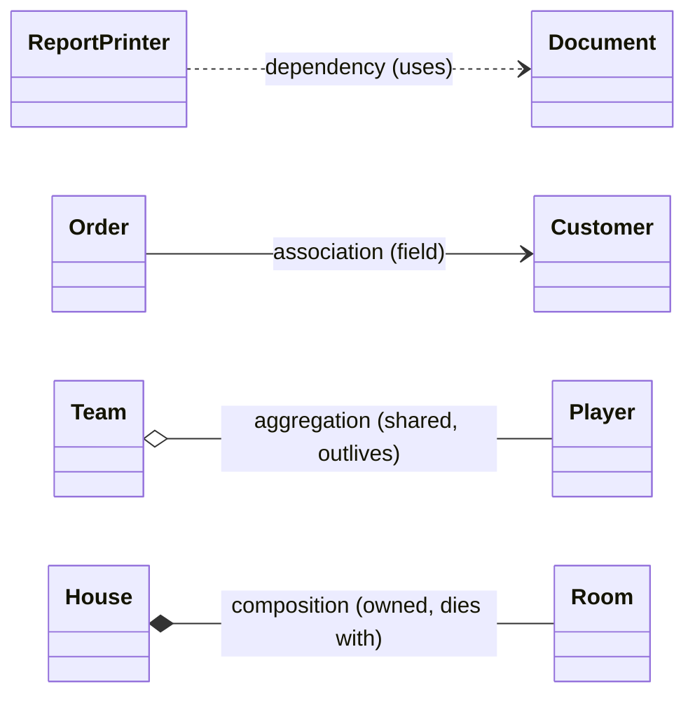

::: {.callout-note appearance="default" collapse="false"}
Explain the difference between:
- Composition vs Aggregation
- Association vs Dependency vs Link
:::

Both questions are really about one underlying axis: **how strongly is one object coupled to another, and for how long?** It helps to see all of these as points on a single spectrum from weakest to strongest, then zoom in on the pairs that get confused.

```
weakest ──────────────────────────────────────────────────► strongest
coupling

 Dependency        Association        Aggregation        Composition
    ..>                -->                o--                *--
  (dashed)           (solid)         (hollow ◇)          (filled ◆)

 "uses it          "holds a ref      "has-a shared      "owns it; part
  briefly"          as a field"       part w/ its own    dies with the
                                      lifecycle"         whole"

 param / local /   stored field      stored field +     stored field +
 return type                         weak ownership     strong ownership
```

Two of these (aggregation, composition) are *whole-part* relationships and live on the right. The other two (association, dependency) are general "knows-about" relationships. Let me take each pair.

## Composition vs Aggregation

Both are "has-a" / whole-part relationships. The difference is **lifecycle ownership and exclusivity** — not the syntax of the line, but what the relationship *means*.

```
COMPOSITION  (filled diamond ◆)        AGGREGATION  (hollow diamond ◇)
"part cannot live without the whole"   "part exists independently"

   ┌──────────┐                           ┌──────────┐
   │  House   │◆───┐                       │   Team   │◇───┐
   └──────────┘    │ owns exclusively      └──────────┘    │ references, shareable
                   ▼                                       ▼
             ┌──────────┐                            ┌──────────┐
             │   Room   │                            │  Player  │
             └──────────┘                            └──────────┘

   delete House ⇒ Rooms gone too         delete Team ⇒ Players live on
   a Room belongs to ONE House           a Player can join many Teams
```

The diamond always sits on the **whole** side. Filled = composition (strong), hollow = aggregation (weak).

Three tests to decide which you have:

1. **Lifecycle** — if I destroy the whole, should the part be destroyed too? Yes → composition. No → aggregation.
2. **Exclusivity** — can the part belong to two wholes at the same time? No → composition. Yes → aggregation.
3. **Origin** — does the whole *create* the part internally, or *receive* it from outside? Created internally → composition. Injected → aggregation.

In C# the field declarations can look almost identical, so test #3 (origin) is the most reliable code-level tell:

```csharp
// COMPOSITION — Order creates its OrderLines internally; they never leak out.
public class Order
{
    private readonly List<OrderLine> _lines = new();

    public void AddLine(Product p, int qty)
        => _lines.Add(new OrderLine(p, qty));   // ◆ born and dies inside Order
}
// No OrderLine has any meaning without its Order.
```

```csharp
// AGGREGATION — Team receives Players that already exist and outlive it.
public class Team
{
    private readonly List<Player> _players = new();

    public void Add(Player player) => _players.Add(player);  // ◇ shared reference
}

var ann = new Player("Ann");   // exists on her own
teamA.Add(ann);                // joins team A
teamB.Add(ann);                // ALSO plays for team B — fine, she's shared
// dispose teamA ⇒ ann is untouched
```

One honest caveat worth knowing, since you care about the philosophy: **aggregation is notoriously fuzzy.** In a garbage-collected language there's no manual destruction, so "the part dies with the whole" is a *logical* statement about ownership, not a literal one about memory. James Rumbaugh, one of UML's authors, half-jokingly called aggregation "a modeling placebo." Many teams skip the hollow diamond entirely and just draw a plain association unless the strong-ownership semantics of composition genuinely matter. Composition is the one that carries real, defensible meaning; aggregation is the one people argue about.

## Association vs Dependency vs Link

These sit on a different conceptual footing. Association and dependency are both *relationship types between classes*, distinguished by **how long the reference lives**. Link is a different kind of thing entirely — it's the *instance-level* version of an association.

### Association vs Dependency — persistence of the reference

```
ASSOCIATION  (solid -->)               DEPENDENCY  (dashed ..>)
"has a stored reference"               "uses it transiently"

  ┌─────────┐      ┌──────────┐         ┌──────────┐  uses  ┌──────────┐
  │  Order  │─────▶│ Customer │         │ Printer  │┄┄┄┄┄┄┄▶│ Document │
  └─────────┘      └──────────┘         └──────────┘        └──────────┘
   field: _customer                      Document is only a
   lives as long as the Order            parameter / local / return —
                                         nothing is stored
```

The dividing line is simple: **is the other type stored as a field, or just used in passing?**

```csharp
// ASSOCIATION — Customer is part of Order's structure (a field).
public class Order
{
    private readonly Customer _customer;            // --> structural, persistent
    public Order(Customer customer) => _customer = customer;
}
```

```csharp
// DEPENDENCY — Document appears only as a parameter; never stored.
public class ReportPrinter
{
    public void Print(Document document)            // ..> transient use
        => Console.WriteLine(document.ToText());
    // ReportPrinter "depends on" Document's definition,
    // but doesn't HAVE a Document.
}
```

Dependency is the weakest relationship there is: "if `Document`'s API changes, `ReportPrinter` might break" — but `ReportPrinter` holds no `Document` in its state. The usual forms are method parameters, return types, local variables, and static calls. This is exactly the relationship you'll draw most in clean architecture when a use-case method *receives* a domain object rather than storing one.

And note the spectrum is nested: composition and aggregation are just *associations with extra whole-part meaning*. So "association" is the general category, and the filled/hollow diamonds are stronger flavors of it.

### Link — the instance-level cousin

Here I owe you a clarification, because I labeled `--` as "Link" in the cheat sheet last turn and that word is overloaded.

In **formal UML**, a link is the *object-level* instance of an association, the same way an object is an instance of a class:

```
ASSOCIATION  (class / type level)         LINK  (object / instance level)

  ┌──────────┐  employs  ┌──────────┐       ramaAI:Company ──── ann:Radiologist
  │ Company  │───────────│Radiologist│           │
  └──────────┘           └──────────┘       ramaAI:Company ──── bob:Radiologist
   "a Company employs Radiologists"          "THIS company is linked to
    — the rule / template                     THESE specific people, right now"

            association : link   ::   class : object
```

So an association is the *rule* that connects two classes; a link is one concrete connection between two specific runtime objects, the kind of thing you'd draw on a UML *object diagram* rather than a class diagram.

Separately, in **Mermaid's own vocabulary**, the plain solid line `A -- B` is colloquially called a "link" and just means a basic, undirected association (you're not specifying which side navigates to which). That's a tooling label, not the formal instance-level concept. Same word, two meanings — worth keeping straight.

## Tying it back to Mermaid

Here's the full spectrum rendered in the syntax you just learned, so the symbols stick:



The quick decision tree, end to end: *Do I store a reference at all?* No → **dependency**. Yes, and it's a plain reference → **association**. Yes, and it's a part I share → **aggregation**. Yes, and it's a part I exclusively own and that dies with me → **composition**.
