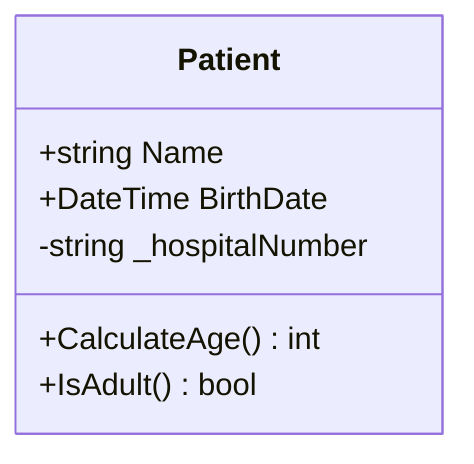
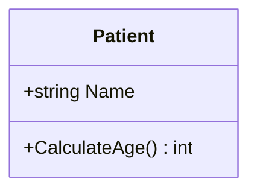
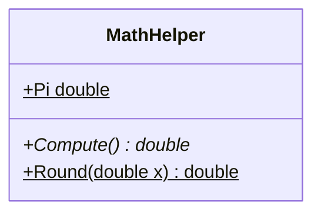
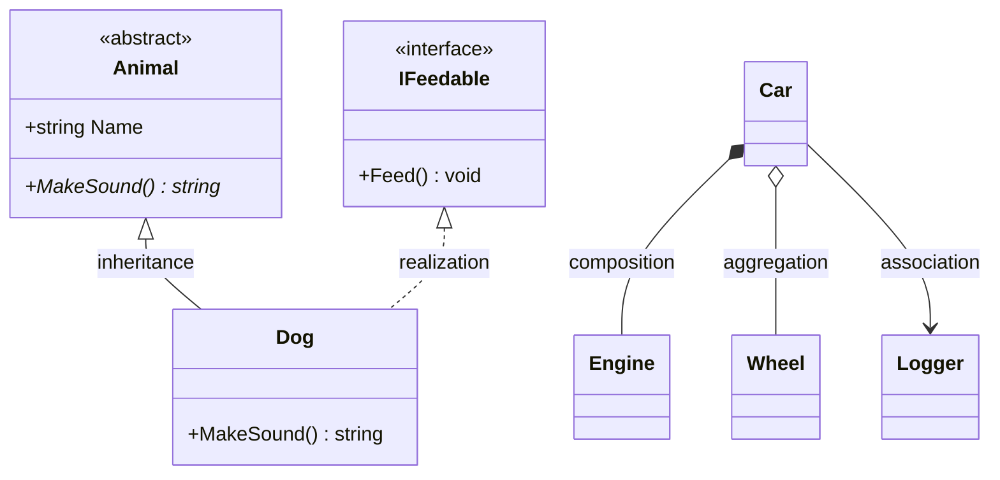
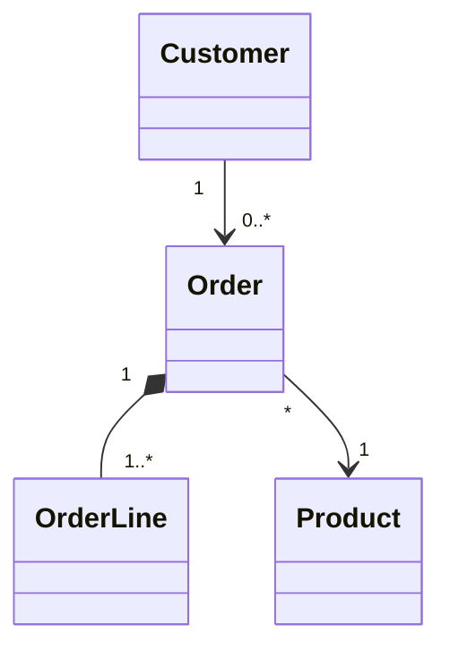
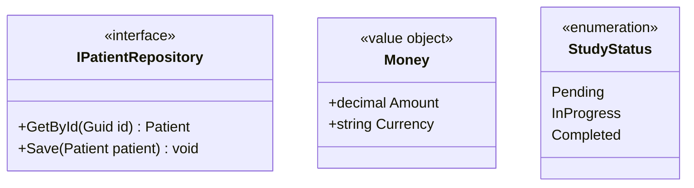
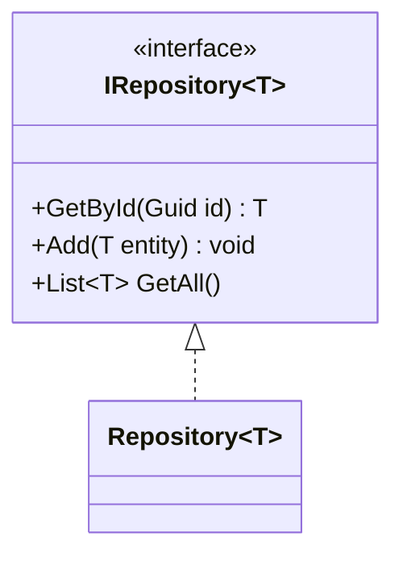
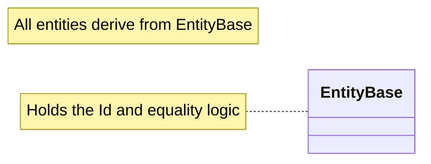
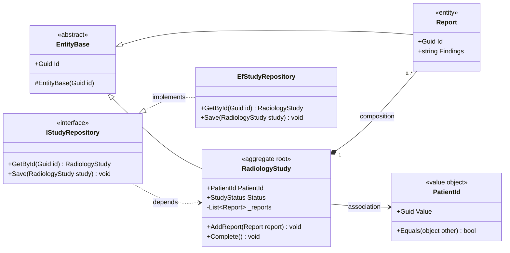

Class diagrams are the workhorse of OOP modeling, and they map almost 1:1 onto C# concepts (classes, interfaces, inheritance, composition). Mermaid's `classDiagram` syntax is also what the Mermaid MCP in this project speaks, so learning it pays off twice.

Let me build it up from the ground.

## 1. The mental model

A Mermaid class diagram has two kinds of statements:

```
classDiagram
    class Foo { ... }       ← node definitions (the boxes)
    Foo --> Bar             ← relationship definitions (the lines)
```

That's the whole grammar. Everything else is filling in details on those two.

## 2. Defining a class and its members

```{mermaid}
classDiagram
    class Patient {
        +string Name
        +DateTime BirthDate
        -string _hospitalNumber
        +CalculateAge() int
        +IsAdult() bool
    }
```



Inside the braces, the rule of thumb is: **fields look like `Type Name` or `Name Type`, methods have `()`**. Mermaid decides "this is a method" purely by the presence of parentheses. Return types go *after* the `()`:

```
+CalculateAge() int        ← public method returning int
+Name string               ← public field
```

You can also declare members outside the braces with a colon, which is handy when generating diagrams programmatically:

```{mermaid}
classDiagram
    class Patient
    Patient : +string Name
    Patient : +CalculateAge() int
```



## 3. Visibility (maps directly to C# access modifiers)

The first character of a member sets visibility:

| Symbol | Meaning | C# equivalent |
|--------|---------|---------------|
| `+` | public | `public` |
| `-` | private | `private` |
| `#` | protected | `protected` |
| `~` | package/internal | `internal` |

And two *trailing* modifiers (placed at the end of the line):

| Symbol | Meaning | C# equivalent |
|--------|---------|---------------|
| `*` | abstract | `abstract` method |
| `$` | static | `static` |

```{mermaid}
classDiagram
    class MathHelper {
        +Pi double$
        +Compute()* double
        +Round(double x) double$
    }
```



Here `Pi` is static (`$`), `Compute()` is abstract (`*`), `Round()` is static.

## 4. Relationships — the important part

This is where UML semantics live, and it's the part people most often get wrong. The arrow *type* encodes the relationship, and the arrow *direction* encodes who points to whom. Here's the full cheat sheet:

| Mermaid | Relationship | Reads as | C# example |
|---------|-------------|----------|------------|
| `A <|-- B` | Inheritance | B *is-a* A | `class B : A` |
| `A ..|> B` | Realization | A *implements* interface B | `class A : IB` |
| `A *-- B` | Composition | A *owns* B (B dies with A) | `B` created/destroyed inside `A` |
| `A o-- B` | Aggregation | A *has* B (B outlives A) | `A` holds a reference to shared `B` |
| `A --> B` | Association | A *uses/references* B | `A` has a field of type `B` |
| `A ..> B` | Dependency | A *depends on* B transiently | `A` takes `B` as a method param |
| `A -- B` | Link (solid) | plain association, no direction | — |

The two tricky symbols to memorize:

- **`<|`** is the hollow triangle = "is-a" (inheritance/realization). The triangle always points at the **parent/interface**.
- **`*` vs `o`** is the diamond = "part-of". Filled diamond (`*`) = composition (strong ownership, shared lifecycle); hollow diamond (`o`) = aggregation (weak, shared). The diamond sits on the **owner/whole** side.

Solid line vs dashed line: **solid = structural** (it's a field/member), **dashed (`..`) = transient** (a parameter, return type, or interface contract).

Worked example showing all of them:

```{mermaid}
classDiagram
    class Animal {
        <<abstract>>
        +string Name
        +MakeSound()* string
    }
    class Dog {
        +MakeSound() string
    }
    class IFeedable {
        <<interface>>
        +Feed() void
    }
    class Engine
    class Wheel
    class Car
    class Logger

    Animal <|-- Dog : inheritance
    IFeedable <|.. Dog : realization
    Car *-- Engine : composition
    Car o-- Wheel : aggregation
    Car --> Logger : association
```



Note `IFeedable <|.. Dog` — that's the same as `Dog ..|> IFeedable`, just written the other direction. Both render the dashed hollow triangle pointing at the interface. You'll write a lot of these in clean architecture, since the whole point is depending on interfaces.

## 5. Multiplicity (cardinality)

Put quoted multiplicity strings on either end of a relationship:

```{mermaid}
classDiagram
    Customer "1" --> "0..*" Order
    Order "1" *-- "1..*" OrderLine
    Order "*" --> "1" Product
```



Common values: `1`, `0..1`, `1..*`, `0..*`, `*`, or exact numbers like `2`. Reads naturally: one `Customer` has zero-or-more `Order`s; an `Order` is composed of one-or-more `OrderLine`s.

## 6. Annotations (stereotypes)

These give a class a `<<label>>` badge — essential for distinguishing interfaces, abstract classes, enums, and DDD building blocks:

```{mermaid}
classDiagram
    class IPatientRepository {
        <<interface>>
        +GetById(Guid id) Patient
        +Save(Patient patient) void
    }
    class Money {
        <<value object>>
        +decimal Amount
        +string Currency
    }
    class StudyStatus {
        <<enumeration>>
        Pending
        InProgress
        Completed
    }
```



Built-in ones include `<<interface>>`, `<<abstract>>`, `<<enumeration>>`, `<<service>>`, but the text is free-form — you can write `<<aggregate root>>`, `<<value object>>`, `<<entity>>`, which is exactly what you'll want for tagging DDD tactical patterns.

## 7. Generics

Use tildes `~T~` instead of angle brackets (since `<>` clash with the arrow syntax):

```{mermaid}
classDiagram
    class IRepository~T~ {
        <<interface>>
        +GetById(Guid id) T
        +Add(T entity) void
        +List~T~ GetAll()
    }
    class Repository~T~
    IRepository~T~ <|.. Repository~T~
```



Nested generics like `List~T~` work inside members too.

## 8. Notes and layout direction

```{mermaid}
classDiagram
    direction LR
    note "All entities derive from EntityBase"
    class EntityBase
    note for EntityBase "Holds the Id and equality logic"
```



`direction` accepts `TB` (top-bottom, default), `BT`, `LR`, `RL`. For layered architectures `LR` often reads better because dependencies flow left-to-right.

## 9. Putting it together — a DDD / clean-architecture slice in C#

Here's a small but realistic example that ties all the pieces to your project's themes — an aggregate root, a value object, a repository interface, and the dependency-inversion arrow that defines clean architecture:

```{mermaid}
classDiagram
    direction LR

    class EntityBase {
        <<abstract>>
        +Guid Id
        #EntityBase(Guid id)
    }

    class RadiologyStudy {
        <<aggregate root>>
        +PatientId PatientId
        +StudyStatus Status
        -List~Report~ _reports
        +AddReport(Report report) void
        +Complete() void
    }

    class Report {
        <<entity>>
        +Guid Id
        +string Findings
    }

    class PatientId {
        <<value object>>
        +Guid Value
        +Equals(object other) bool
    }

    class IStudyRepository {
        <<interface>>
        +GetById(Guid id) RadiologyStudy
        +Save(RadiologyStudy study) void
    }

    class EfStudyRepository {
        +GetById(Guid id) RadiologyStudy
        +Save(RadiologyStudy study) void
    }

    EntityBase <|-- RadiologyStudy
    EntityBase <|-- Report
    RadiologyStudy "1" *-- "0..*" Report : composition
    RadiologyStudy --> PatientId : association
    IStudyRepository <|.. EfStudyRepository : implements
    IStudyRepository ..> RadiologyStudy : depends
```



The thing to notice — and this is the heart of clean architecture — is that `IStudyRepository` lives in the domain layer and the concrete `EfStudyRepository` (infrastructure) points *inward* via the dashed realization arrow. The dependency arrow goes from infrastructure to domain, never the reverse. The diagram makes the dependency rule visually obvious, which is one reason these are worth drawing.

