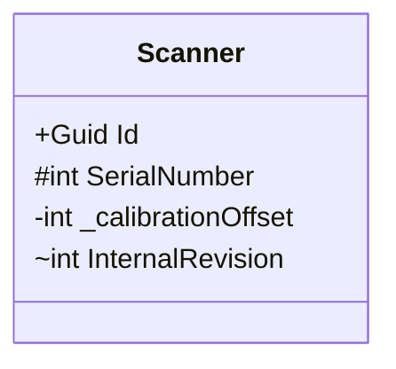

These three answer **different questions**, which is the key to keeping them straight. `private` and `protected` are about the *inheritance* relationship, while `internal` is about the *assembly* (the compiled `.dll`) boundary. They sit on two independent axes:

```
   INHERITANCE AXIS                    ASSEMBLY AXIS
   "who in the family tree            "who in the same compiled
    can see it?"                       unit can see it?"

   private    → me only               internal → anyone in THIS
   protected  → me + my subclasses                .dll, related or not
```

Because they're independent axes, the interesting part is what happens when you cross them — which is why C# actually has *five* member modifiers, not three. Let me take the three you asked about first, then show how they combine.

## The three, concretely

**`private` — the declaring type only.** The narrowest. Visible only inside the body of the same class (nested types count as "inside"). Not even a subclass can see it.

```csharp
public class Scanner
{
    private int _serialNumber;          // only Scanner's own code touches this
}

public class CTScanner : Scanner
{
    void M() => _serialNumber = 1;      // ❌ compile error — subclass can't see private
}
```

**`protected` — the type and its subclasses, anywhere.** This is the *inheritance* grant. Crucially, it **crosses assembly boundaries** — a subclass in a completely different `.dll` can still see a `protected` member. But a non-subclass, even one sitting right next to it in the same file, cannot.

```csharp
public class Scanner
{
    protected int SerialNumber;         // family-only
}

public class CTScanner : Scanner
{
    void M() => SerialNumber = 1;       // ✅ subclass can see it (even in another assembly)
}

public class Hospital
{
    void M(Scanner s) => s.SerialNumber = 1;  // ❌ not a subclass — no access
}
```

**`internal` — the whole assembly, related or not.** This is the *assembly* grant and C#'s closest match to UML's `~` "package" visibility. Anyone compiled into the same `.dll` can see it; nobody outside can — **not even a subclass in another assembly**. It ignores the inheritance tree entirely and keys purely off "are we in the same compiled unit?"

```csharp
// --- Domain.dll ---
public class Scanner
{
    internal int SerialNumber;          // visible to everything in Domain.dll
}
public class Hospital
{
    void M(Scanner s) => s.SerialNumber = 1;  // ✅ same assembly, unrelated class — fine
}

// --- Plugins.dll (references Domain.dll) ---
public class MRIScanner : Scanner
{
    void M() => SerialNumber = 1;       // ❌ subclass, but DIFFERENT assembly — no access
}
```

That last failure is the one that surprises people: `protected` would have allowed it (subclass), `internal` forbids it (wrong assembly). The two modifiers protect against *different* things.

## The full accessibility matrix

Here's every modifier against every kind of accessor. Reading it left-to-right shows accessibility widening:

```
                                same   subclass   unrelated   subclass    unrelated
                                class  same-asm   same-asm    other-asm   other-asm
  ──────────────────────────────────────────────────────────────────────────────
  private                        ✓        ✗          ✗           ✗           ✗
  private protected              ✓        ✓          ✗           ✗           ✗
  protected                      ✓        ✓          ✗           ✓           ✗
  internal                       ✓        ✓          ✓           ✗           ✗
  protected internal             ✓        ✓          ✓           ✓           ✗
  public                         ✓        ✓          ✓           ✓           ✓
```

Notice `protected` and `internal` are *incomparable* — neither row contains the other. `protected` reaches column 4 but not column 3; `internal` reaches column 3 but not column 4. That's the orthogonality made visible.

## Why C# has five: the combinations

Because the two axes are independent, C# lets you combine them — and the names are famously counterintuitive:

- **`protected internal`** = protected **OR** internal (the **union** — *more* permissive). Visible to anything in the same assembly, **plus** subclasses anywhere.
- **`private protected`** = protected **AND** internal (the **intersection** — *more* restrictive). Visible only to subclasses that are **also** in the same assembly. (C# 7.2+.)

The trap: `protected internal` *sounds* like "two restrictions stacked," but it's the loosest of the family-or-assembly options. The keyword order doesn't imply "and."

This all forms a clean lattice, which is the most compact way to hold it in your head:

```
                    public              ← everyone
                      │
              protected internal        ← union  (protected ∪ internal)
                ╱            ╲
         protected          internal    ← the two independent axes
                ╲            ╱
              private protected         ← intersection (protected ∩ internal)
                      │
                   private              ← declaring type only
```

Going up = wider access. The two middle nodes are the pure axes; the node above is their union, the node below their intersection.

## UML / Mermaid mapping (and one honest caveat)

Back to the symbols from the first lesson:

```
  +   public      → public
  #   protected   → protected
  -   private     → private
  ~   package     → internal   (closest analog, but NOT exact)
```

The caveat on `~`: UML's "package" visibility (inherited from Java's package-private) means *same namespace*. C#'s `internal` means *same assembly* — a different boundary, since one `.dll` can span many namespaces and you can't restrict to a single namespace in C# at all. So when you see `~` on a C# class diagram, read it as `internal`/assembly-scoped, not namespace-scoped. Mermaid has no distinct symbols for `protected internal` or `private protected`, so people usually just annotate those in the member text or a note.



---

For your clean-architecture work, the practical rule of thumb: reach for `internal` to hide a whole infrastructure implementation inside its assembly while still exposing a `public` interface, use `private` aggressively for entity invariants (so only the aggregate root can mutate its own state), and use `protected` sparingly — it's a deliberate extensibility contract with subclasses, not a default. Want me to show how those three play out in a layered C# solution, where assembly boundaries *are* the architecture boundaries?